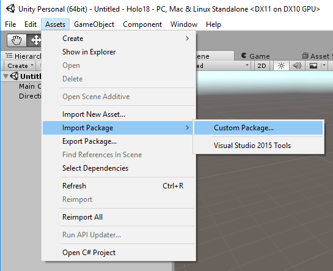
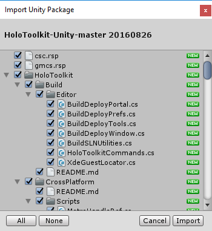
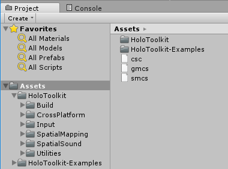
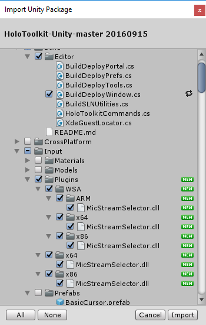

# HoloToolkit-Unity-Packages
Unity packages created from [HoloToolkit Unity repository](https://github.com/Microsoft/HoloToolkit-Unity), to be used on Unity 3D projects for Hololens.

This is based on my post on [How to use and update HoloToolkit in Unity](https://elbruno.com/2016/09/16/hololens-this-is-the-right-way-to-wotk-with-unity-packages-and-holotoolkit/)

# Use the HoloToolkit Unity Package in a Unity project

Create a new 3D project in Unity
Now we must import the HoloToolkit package we want to use, my main suggestion is always go for the latest one.
Select the menu [Assets / Import Package / Custom Package]

This option will show us the elements of the Unity Package we want to import. For this sample, I will import one package a couple of weeks old to show the correct way of update a package later.

At this time, Unity is responsible for importing all the elements (this is similar to copy all the files in the Assets directory)
Once imported, you can see all the items in the Assets directory

We can now begin to work with the HoloToolkit assets in our Unity project

# Update a HoloToolkit package in Unity

In this scenario we will perform the same steps to import a package
The important point here, is when there are changes in the package. We will we be warned when we are going to import the package
For example in the picture below you can see changes in the file [Build / Editor / BuildDeployWindow.cs] and new files in [Imput / Plugins / … ]

This allows us to know the changes which exist between different versions of a package, and also to select the items that we want to use
 

And this is the correct way to work with Unity Packages applied to HoloToolkit.
